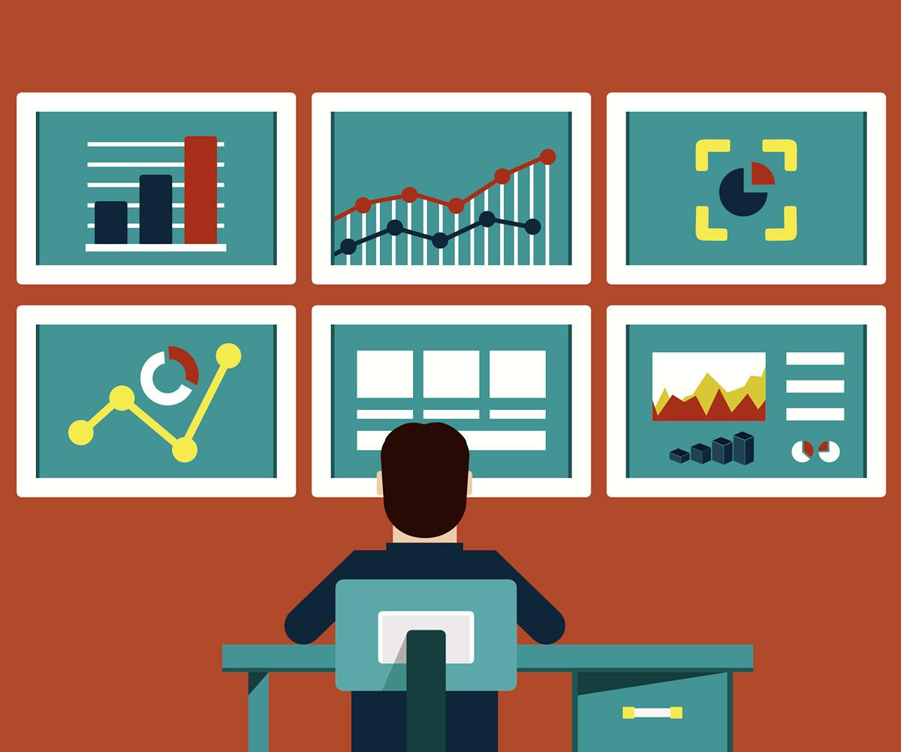

# Data Dashboard

Nuestro proyecto intenta resolver el problema que las **Training Managers (TMs)** enfrentan al manipular la información de las estudiantes de **Laboratoria** a nivel global.

### ¿Cómo se usa? :+1:

*Usuario*
1.Click en la siguiente liga https://genesismauries.github.io/cdmx-2018-06-bc-core-am-data-dashboard/src/index.html

2.En la página principal es necesario ingresar los siguientes datos:
- **Usuario:** admin 
- **Clave:** 1234
 
3.Enseguida podrás seleccionar la sede y la generación a visualizar.

*Contribuidor*
 1.Fork en este repositorio
 2.Instala dependencias
 3.Solicita un pull requests

### Funciones.

Contamos con dos funciones en desarrollo con las siguientes características:
- **computeStudentsStats:** Obtiene array de objetos con Correo, Generación, Nombre, Sede y Porcentaje completado.
- **computeGenerationsStats:** Obtiene array de Campus, Generation, Average y Count.

### Limitaciones conocidas.
El equipo de desarrollo formado por: Ana Vazquez, Queletzú Pratts y Génesis Mauries concuerda en que la investigación es un proceso permanente para logar los conocimientos necesarios y avanzar en el desarrollo del proyecto.

